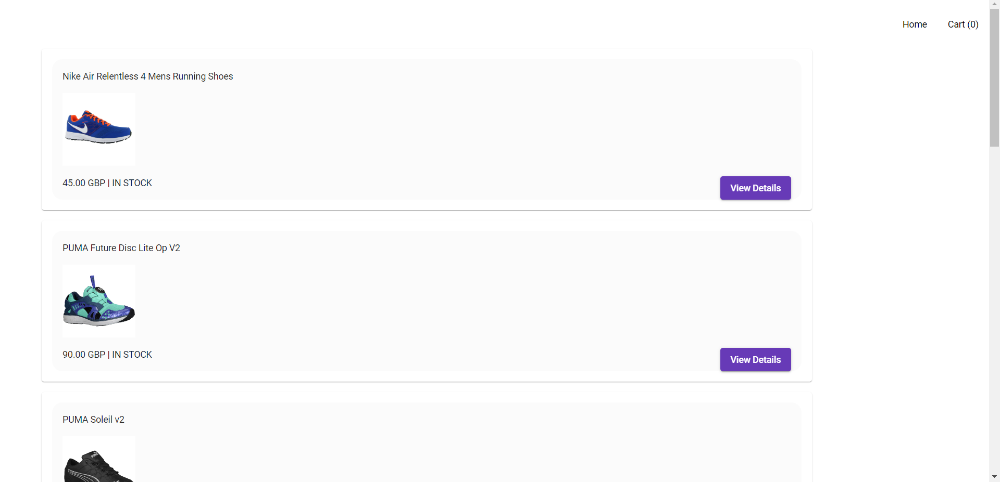
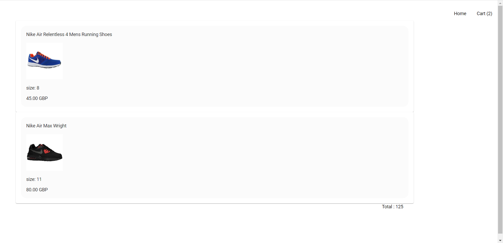

# ShoppingApp

This is an application implemented with the basic functionality of an ecommerce application. Users can 
1. View the list of products available.
2. View more details of a selected product.
3. Add selected product to cart.

## Implementation

Product list, Product and Cart are three different components to increase modularity of the application. Angular router is used for navigation.
On navigating to the application product list is shown. 

Once an item is selected router navigates to Product component.

Services are used to retrieve product list from the API and to manage cart.

## Steps
1. Create a new angular project.
2. Generate components ProductList, Product and Cart
3. Add angular routing to navigate between the pages.
4. In ProductList component the list of products is shown including buttons to navigate to selected product.
5. In Product compenent detailed information on a product is shown including a button to navigate back to product list and a button to add the product to cart.
6. Nav bar is added to navigate to home (product list) or cart from anywhere in the applicatioin.
7. In Cart component the list of items added to the cart are shown including the total cost of the items.
8. Dependency injection principle to is used to share data between components using services which supports loose coupling of components.
9. In ProductService product details are retrieved from the url as an observable and in components where observerbale is subscribed are unsubscribed in OnDestroy.

## Development server

Run `ng serve` for a dev server. Navigate to `http://localhost:4200/`. The application will automatically reload if you change any of the source files.

## Code scaffolding

Run `ng generate component component-name` to generate a new component. You can also use `ng generate directive|pipe|service|class|guard|interface|enum|module`.
